# 1-ая Практика Linux - Да Это Жестко

## 1 Настроил все 3 виртуальные машины, согласно схеме ниже:

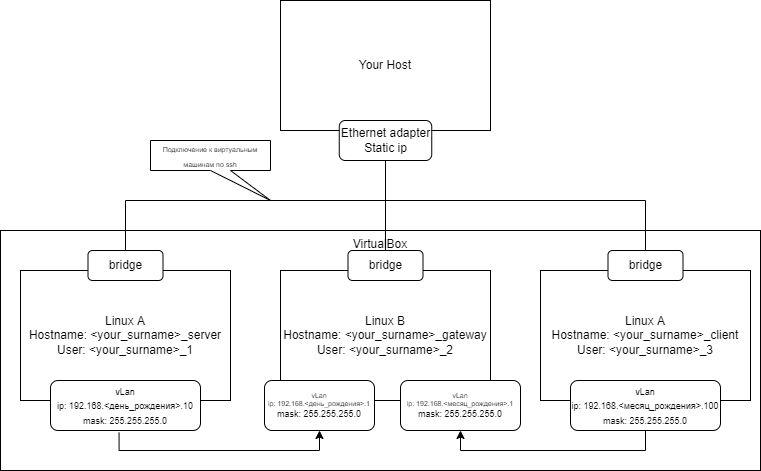
   
1. Установил и запустил машины, настроил есть на сетевые мосты и внутренние сети:

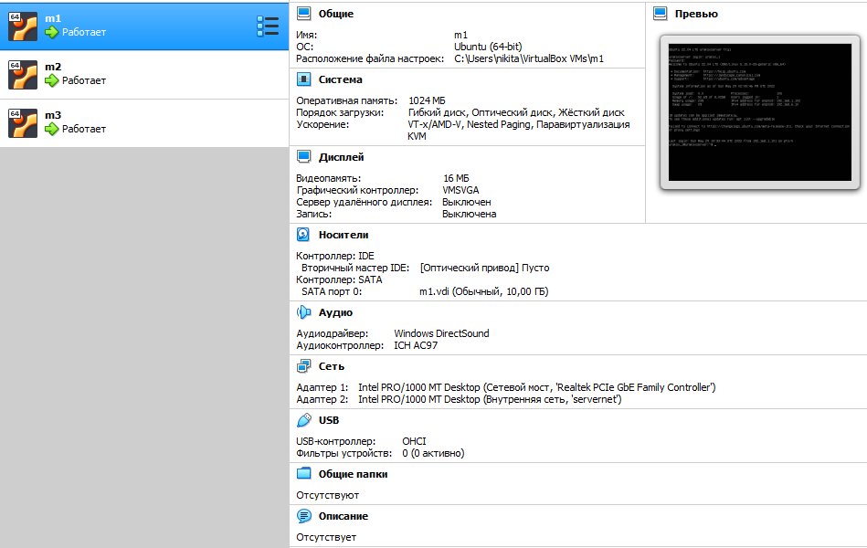

2. Залогинился в каждую из машин, поменял *hostname* и *username* :

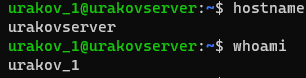
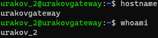
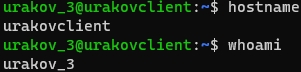

3. Настроил ***netplan***:

* Вывожу *ip addr*
* 
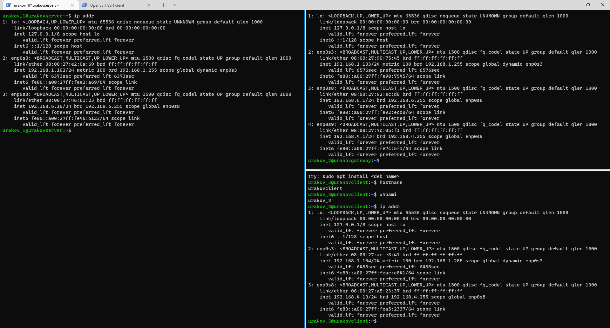

* Вывожу *netplan*:

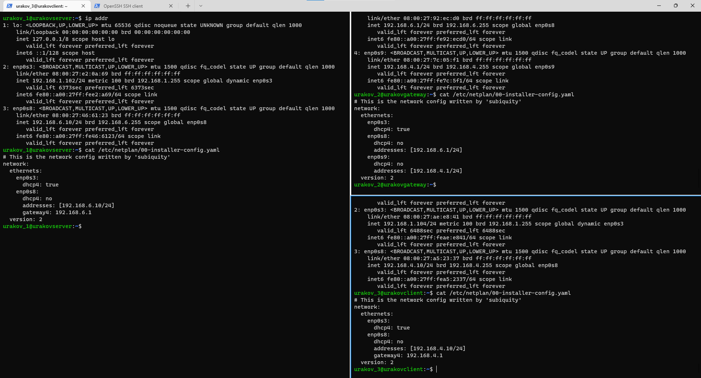

## Конфигурирую маршруты - конфигурирую шлюз:

1. Разрешил переброс пакетов ip в gateway:
Сделал для того, чтобы  виртуальные машины А и С могли видеть друг друга в сети 2 (Linux B)

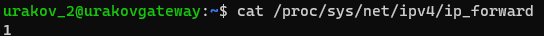

2. Разрешил переброс только конкретных пакетов по конкретному порту с помощью *iptables* для:
* Ограничения траффика;
* Сделал firewall. (да, это жестко)

```shell
$ sudo iptables -A FORWARD -i enp0s9 -o enp0s8 -p tcp --syn --dport 5000 -m conntrack --ctstate NEW -j ACCEPT

$ sudo iptables -A FORWARD -i enp0s9 -o enp0s8 -m conntrack --ctstate ESTABLISHED,RELATED -j ACCEPT
$ sudo iptables -A FORWARD -i enp0s8 -o enp0s9 -m conntrack --ctstate ESTABLISHED,RELATED -j ACCEPT

$ sudo iptables -P FORWARD DROP
```

3. Также сохранил правила *iptables*, чтобы работали после перезагрузки:

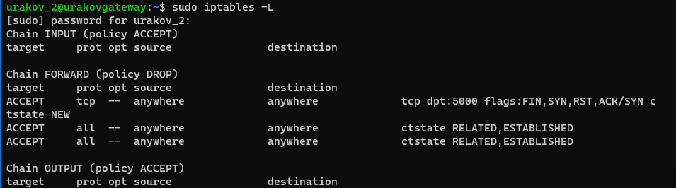

## Настраиваю веб-сервер (машину А)

1. Установил Flask
2. Создал python-скрипт:

```shell
from crypt import methods
from flask import Flask, request

app = Flask(__name__)

@app.route("/", methods=['GET'])
def hello_world():
    return "<p>Hello, World!</p>\n"

@app.route("/number", methods=['PUT'])
def number():
    return f"<p>Zhopa gorit uzhe {request.form['number']} raz!!!!</p>\n"

@app.route("/command", methods=['POST'])
def command():
    return f"<p>Your Command - {request.form['command'].upper()}</p>\n"

if __name__=="__main__":
   app.run(host='0.0.0.0', port=5040, debug=True)
```
3. Создал сервис, который запускает скрипт через автозагрузку

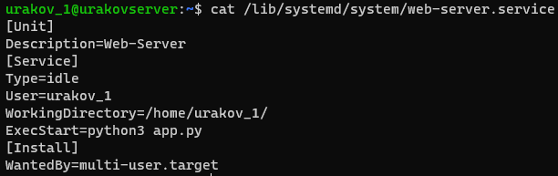

4. Перезапустил службы, активировать автозагрузку, включил сервер и вывел его статус:

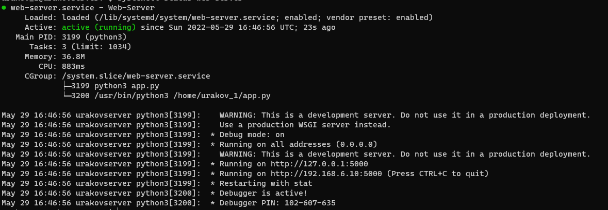

Использовал следующие команды:

```shell
$ sudo systemctl daemon-reload
$ sudo systemctl start web-server
$ sudo systemctl enable web-server
$ sudo systemctl status web-server
```

## Работаю с веб-клиентом (машиной С)

1. Послыаю запросы GET, PUT, POST на машину А, получаю ответы:

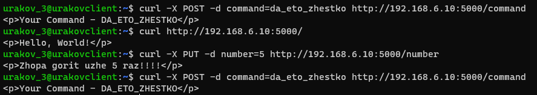

## Поменяю в python-скрипте порт на 5040:

1. Меняю значение в скрипте

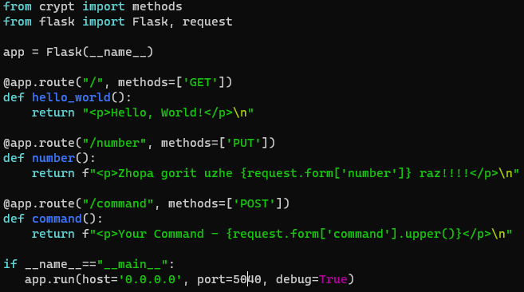

2. Вывод клиента

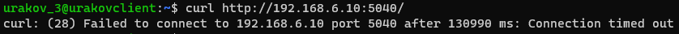

<a href="url">Спасибо за внимание!</a>